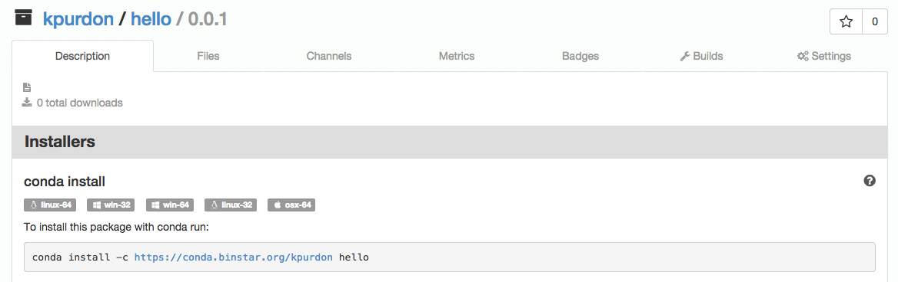

:::{.callout-warning}
This post was written in in 2015 and much of this information is now out of date. For
example, Python 2.7 is long past end-of-life and Binstar no longer exists.

Use at your own risk!
:::


## What is Conda/Anaconda?

### Conda

Conda is an alternative to the traditional Python development, packaging, and deployment
environment. It replaces [pip](https://pypi.python.org/pypi/pip) with
[conda](http://conda.pydata.org/docs/),
[virtualenv](https://virtualenv.pypa.io/en/latest/) with [conda
env](http://conda.pydata.org/docs/faq.html#env), [PyPI](https://pypi.python.org/pypi)
with [binstar](https://binstar.org), and [sdist/wheel
packages](https://packaging.python.org/en/latest/) with [conda
packages](http://conda.pydata.org/docs/build_tutorials/pkgs.html). That's right,
everything! However, you can still use all of the standard python tools with conda. For
example you can pip install a package into a conda environmnet and a conda package is
just a binary package wrapped around a standard python sdist package.


### Anaconda

Anaconda is a set of (as of this post) 195 of the most popular packages for science,
math, engineering, and data analysis. Basically, it's a curated set of packages you will
need to get started with python. You do not have to use Anaconda to use conda. Miniconda
is a lightweight version that provides all of the base tools without all of the packages
that anaconda provides. We'll talk more about this later!


---


### Development Environment Basics

The first step in our transition to using conda was getting a basic development
environment set up. With conda this is extraordinarily easy. Most of us develop on OSX,
but this process is nearly the same for Linux and even Windows machines as well. For the
most up to date installation instructions [see this
page](http://continuum.io/downloads).


### Installing Miniconda

Miniconda is the best place to start if you're an experienced developer. It gives you
the most lightweight, clean base to build off of. To install miniconda simply:

```bash
$ wget http://repo.continuum.io/miniconda/Miniconda-latest-MacOSX-x86_64.sh
$ bash Miniconda-latest-MacOSX-x86_64.sh
```

Follow the installation process and make sure to add the installation to your PATH.

```bash
$ export PATH="/Users/[username]/miniconda/bin:$PATH" # add this to .bashrc
```

In addition I recommend installing argcomplete for conda command  tab completion. This
process is very simple:

```bash
$ conda install argcomplete
$ eval "$(register-python-argcomplete conda)" # add this to .bashrc
```


### Conda Environments

The first thing you'll want to figure out is how to use conda environments (the
virtualenv equivelant). Luckily this is also very simple! Let's create a new environment
and install some packages:

```bash
$ conda create -n test numpy
```

This command just created a new conda environment called `test` and installed the numpy
package. To activate this environment simply run:

```bash
$ . activate test # source activate test
```

Run the following command to see a list of installed packages:

```bash
$ conda list
```

You'll see that `python 2.7.9` is listed as a dependency. Python itself is actually just
a package to conda. This means in any environment at any time you can change your python
version and it will update dependencies for you. What this means is that conda env's can
also act as a replacement for [pyenv](https://github.com/yyuu/pyenv).

There is much more information on conda environments
[here](http://conda.pydata.org/docs/faq.html#env)


#### TIP: `conda install anaconda` will install all of the packages in Anaconda!


---


## Packaging Basics

The simplest way to explain how conda packaging for Python works is a simple example.
Let's assume we have to following project structure:

```bash
├── hello
│   ├── __init__.py
│   └── hello.py
├── meta.yaml
└── setup.py
```

Other than the file `meta.yaml` this is just a standard python package. Here is the file
`hello.py`:

```python
import click


@click.command()
@click.argument('name')
def hello(name):
    print('Hello, {}'.format(name))

if __name__ == '__main__':
    hello()
```

I have included [click](http://click.pocoo.org/4/) here so that we can see how
dependencies are handled in the packaging process. The file `setup.py` follows:

```python
from setuptools import setup, find_packages

setup(
    name='',
    version='',
    description='',
    url='',
    author='',
    author_email='',
    license='',
    packages=find_packages()
)
```

You'll notice here that none of the information is filled out. This is a piece we at
NSIDC have not really figured out. All of the metadata (name, version, ...) is actually
stored in the conda file `meta.yaml` but the `setup.py` is still used to build the
python package (which gets wrapped up in the conda package). If you're reading this and
have some clarification on this issue please let us know! Finally, the `meta.yaml`:

```yaml
package:
  name: hello
  version: "0.0.1"

source:
  path: .

build:
  script: flake8 */*.py && python setup.py install
  entry_points:
    - hello = hello.hello:hello

requirements:
  build:
    - python 2.7*
    - flake8
  run:
    - python 2.7*
    - click

test:
  commands:
    - hello --help
```

With all of these files in place we can build a conda package. Note you will need to
`conda install conda-build` first. To build the package simply run the following command
from the directory with `meta.yaml`:

```bash
$ conda build .
```

This command will read the `meta.yaml` and execute the build using all of the
information we have given it. Note the `script` entry tells build to run flake8 and then
setup.py install. This will check the syntax and then build/install the python package
using `setup.py`. One great thing about conda is that it does its builds in isolated
environments by default! Once the build is complete you will get some output that tells
you where the package was built and what to do next. In my case the package built was:

```
/Users/kpurdon/miniconda/conda-bld/osx-64/hello-0.0.1-py27_0.tar.bz2
```

You should note that this package is an osx-64 specific binary. In the next section
(Deployment Basics) I will demonstrate how to build packages for all architectures. For
now let's just install the new package:

```bash
$ conda install /Users/kpurdon/miniconda/conda-bld/osx-64/hello-0.0.1-py27_0.tar.bz2
```

The package should install, including its dependencies (Python 2.7* and Click). We can
now execute the entry-point command `hello` we defined in `meta.yaml` and see the
expected output:

```bash
$ hello Kyle
Hello, Kyle
```


### Dependencies Not on Binstar

At some point you will run into a situation where a python dependency you need is not yet converted to a conda package and released on binstar. For development you can just `pip install [pkg]` into your conda env, but for packaging you will want the package to be in conda and on binstar. Luckily this is very easy!

```bash
$ conda skeleton pypi [somepackage]
$ conda build [somepackage]
# now follow the binstar upload instructions in the next section!
```

With just a few simple commands you can take a python package that is on PyPI, create a conda package, build it, and be ready to upload it to your own channel on binstar!

---


## Deployment Basics

Once we have a conda package we'll need to deploy it to some package repository.
Normally you would upload a Python package to PyPI. The conda equivalent to PyPI is
[Binstar](https://binstar.org). You can also create a local repository using [custom
channels](http://conda.pydata.org/docs/custom-channels.html).

### Creating Multi-Arch Packages

In the packaging example the following file was created:

```
/Users/kpurdon/miniconda/conda-bld/osx-64/hello-0.0.1-py27_0.tar.bz2
```

This is a package specific to the osx-64 architecture. To create packages for all conda
supported architectures from this package is very simple:

```bash
$ cd /Users/kpurdon/miniconda/conda-bld/
$ conda convert osx-64/hello-0.0.1-py27_0.tar.bz2 -p all
```

After running this command all the packages we'll need to upload should be created. You
can check this with the following command:

```bash
$ find . -name hello*
./linux-32/hello-0.0.1-py27_0.tar.bz2
./linux-64/hello-0.0.1-py27_0.tar.bz2
./osx-64/hello-0.0.1-py27_0.tar.bz2
./win-32/hello-0.0.1-py27_0.tar.bz2
./win-64/hello-0.0.1-py27_0.tar.bz2
```

### Uploading To Binstar

Before we can upload to Binstar we'll need to complete two simple tasks:

1. Register at [Binstar.org](https://binstar.org)
2. `conda install binstar`

Now all we need to do to upload all of these packages to Binstar is run the following
command:

```bash
$ binstar upload */hello-0.0.1-py27_0.tar.bz2
```

You should now see the package on binstar, here is an example:




---


## Wrap-Up

### Scientific Python, Finally Just Works.

In addition to the very clean development and packaging worflow offered by conda the
greatest benefit is how it handles non-python native packages (Numpy, SciPy, ...). No
longer are there ANY issues requiring packages as dependencies or needing to compile
packages each time. A simple `conda install scipy` just works, every time. For those of
you that work extensively with these scientific python packages this is a breakthrough.

### Conclusion

Conda has so far solved nearly all of our issues with packaging and deploying Python
packages. It has replaced our development environments, and continues to surprise us
with new features frequently. If you do any work with scientific python you should be
installing conda right now.

There is SO MUCH MORE to be covered in the conda ecosystem. Here are a couple topics we
hope to cover in future posts:

* Automating miniconda installation on virtual machines with Puppet.
* An automation workflow for snapshot (development) packages.
