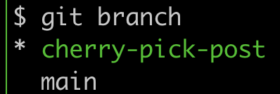
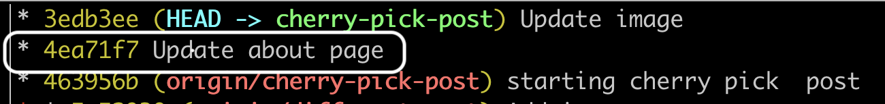
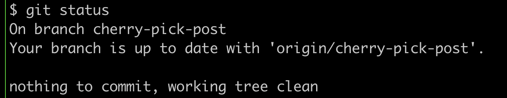
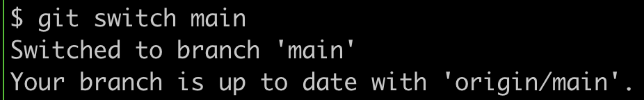
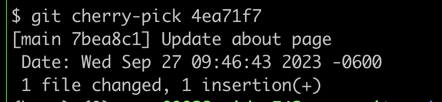
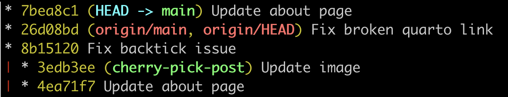
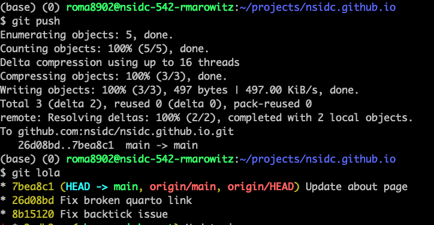
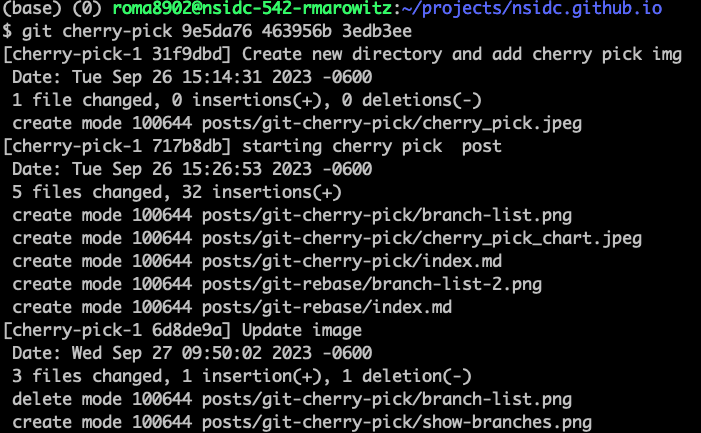
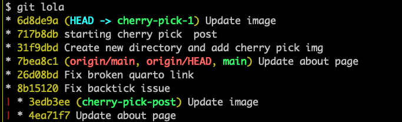
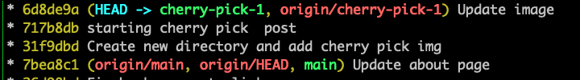

## What is git cherry-pick?

It is the act of picking a commit from one branch and applying it to another branch.  

## When should I use cherry-pick?

Cherry-Pick is best used when a change has been committed onto a different branch than desired. You can *pick* commits one by one and move them to the desired branch. 

`git cherry-pick` usually brings a commit from somewhere else and applies it on top of your current branch, recording a new commit, while `git rebase` takes your current branch and rewrites a series of its own tip commits in one way or another.

## Git command/syntax:

When using cherry pick it is very important to look at your git log and understand what is gong on.

First it can be useful to look at the branches you have. I did this with the `git branch` command and as you can see the one with the asterik and in green is the branch I am currently on. 

I use `git lola` which is an alias:  `lola = log --graph --decorate --oneline --all`. I highly recommending adding this alias to your `.gitconfig`. 

Here you can see that I have my `HEAD` at `cherry-pick-post`. I have made changes to the about section which I actually wanted to do on the main branch. So I will use `git cherry-pick` to make that happen. First you want to be sure you are on the branch that you want to put the commit on.

I can see I am on the `cherry-pick-post` branch so I will use `git switch` to go to the main branch. 

Now I am on the desired branch so I can go ahead and `cherry-pick`

I want to use the syntax `cherry-pick <commit>`

To see what thisdid we will once again do `git lola`

Now the `Update about page` commit is on both the `cherry-pick-post` branch and the `main` branch. The commit ID is a new ID on the main branch. 

We will now push and look at the gt log again. 

At this point `main` appears exactly as we want it to, but `chery-pick`-post` still has the unwanted commit. 

So at this point we will once again use the cherry-pick command to mve forward. I will create a new branch called `cherry-pick-1` fro the main branchh.

Now at this point I want to take everything from the old `cherry-pick-post` branch and pick it to my new branch. 

There are 3 commits that I want so I can actually pick them all a once. 

`git cherry-pick 9e5da76 463956b 3edb3ee`

GitHub gives a great summary of what is happening and shows the commits I am picking. 
To see where I am at I will do `git lola` once again.

At this point I have the 3 commits I want on my new branch so I can go ahead and push that branch. `git push -u origin cherry-pick-1`

Now I no loger want the old branch so I will delete it usingg `git branch -D cherry-pick-post` this will only delete it locally, so you will need to do `git push origin :cherry-pick-post` to delete it from GitHub as well.
