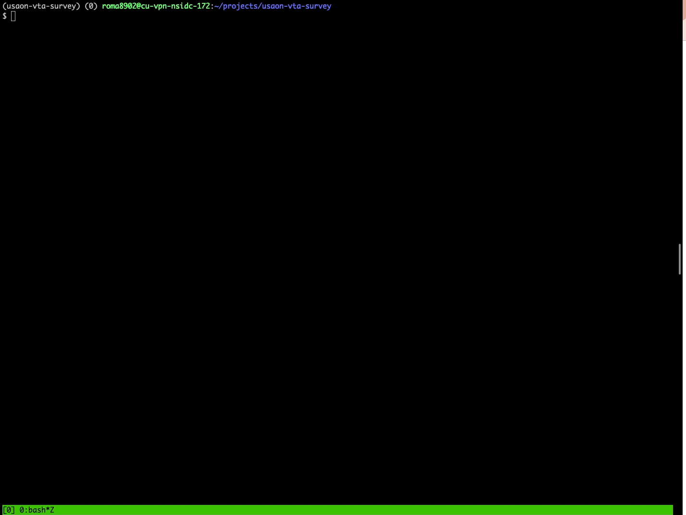
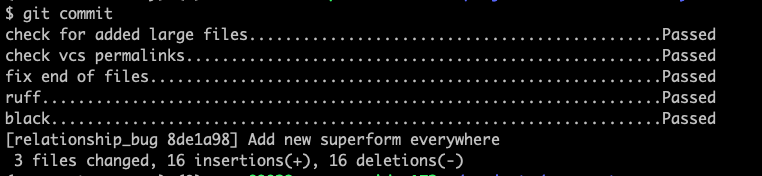

Adopting *pre-commit* in combination with *Ruff* has drastically improved our development experience.
These two tools together establish a tighter feedback loop during local development and lower the mental burden of our tooling.
Additionally, these tools are under active development and are being broadly adopted by Python communities.


### Why *pre-commit*?

Instead of remembering to manually run tools and checks, *pre-commit* allows sharing configuration for processes that run automatically when you create a commit.


### Why *Ruff*?

*Ruff* is a new Python linter written in Rust.
*Ruff* is an order of magnitude faster than similar tools we normally use at NSIDC, like Flake8.
*Ruff* re-implements many of the rules from the Flake8 ecosystem, in addition to other linters and formatters like *pyupgrade* and *isort*, and also adds many new rules.
What makes *Ruff* a gamechanger is that it can automatically fix many of the rule violations that we regularly encounter, tightening the feedback loop.


## Installing

### Installing *pre-commit*

There are various ways to install *pre-commit* outlined in the [installation docs](https://pre-commit.com/#installation).

Using pip:

```bash
pip install pre-commit
```

Using conda:

```bash
conda install -c conda-forge pre-commit
```


#### Configuring *pre-commit*

Once you've installed the *pre-commit* software, it must be configured in a file at the root of your repository named `.pre-commit-config.yaml`.
Once the configuration is in place, the configuration must be installed as a Git hook with the following command:

```bash
pre-commit install
```


### Installing *Ruff*

*Ruff* can be installed with *pre-commit*!
If you've configured *pre-commit* to run *Ruff*, for example by including the following in `.pre-commit-config.yaml`:

```yaml
repos:
  - repo: "https://github.com/astral-sh/ruff-pre-commit"
    rev: "v0.0.291"
    hooks:
      - id: "ruff"
        args: ["--fix", "--exit-non-zero-on-fix"]
```

Running `pre-commit` will trigger all of its dependencies (here, just Ruff) to be automatically installed in a cached environment.


## Using *pre-commit* and *Ruff*

Once you've installed a *pre-commit* configuration as documented above, running *Ruff* is as easy as `git commit`. 
This will always be the fastest way to run *pre-commit* checks, as it requires no additional work, and because *pre-commit* will only run checks on files changed in this commit.

TODO: Add a gif recording 

Some ways you might want to run *pre-commit* manually:

* `pre-commit run --all-files` (or `-a`): Run all checks on all files.
* `pre-commit run ruff --all-files`: Run the check with id `ruff` on all files.
* `pre-commit run ... --files [FILES ...]`: Run *pre-commit* on specified files only.


### Configuring *Ruff*

*Ruff* can be configured using `pyproject.toml`. 
An example is shown below:

```toml
[tool.ruff]
select = [
  "E", "F", "W", # flake8
  "B",           # flake8-bugbear
  "I",           # isort
  "ARG",         # flake8-unused-arguments
  "C4",          # flake8-comprehensions
  "EM",          # flake8-errmsg
  "ICN",         # flake8-import-conventions
  "ISC",         # flake8-implicit-str-concat
  "G",           # flake8-logging-format
  "PGH",         # pygrep-hooks
  "PIE",         # flake8-pie
  "PL",          # pylint
  "PT",          # flake8-pytest-style
  "PTH",         # flake8-use-pathlib
  "RET",         # flake8-return
  "RUF",         # Ruff-specific
  "SIM",         # flake8-simplify
  "T20",         # flake8-print
  "UP",          # pyupgrade
  "YTT",         # flake8-2020
  "EXE",         # flake8-executable
  "NPY",         # NumPy specific rules
  "PD",          # pandas-vet
]
```

More information regarding `pyproject.toml` is available on the [*Ruff* docs](https://docs.astral.sh/ruff/configuration/#using-pyprojecttoml).

All of the available rules can be seen [here](https://docs.astral.sh/ruff/rules/).


### Only run *pre-commit* checks on relevant files

Some checks or tools can be [filtered by file type](https://pre-commit.com/#filtering-files-with-types).
A common use case is to use `types_or`, but it's also possible to [exclude types](https://pre-commit.com/#hooks-exclude_types) or [and types](https://pre-commit.com/#hooks-types).

```yaml
  - repo: "https://github.com/pre-commit/mirrors-prettier"
    rev: "v3.0.3"
    hooks:
      - id: "prettier"
        types_or: ["yaml", "markdown"]
```

It's also possible to [match filenames on a regex pattern](https://pre-commit.com/#hooks-files), or [exclude filenames on a regex pattern](https://pre-commit.com/#hooks-exclude).


We've adopted *pre-commit* and *Ruff* on several projects, including [QGreenland](https://github.com/nsidc/qgreenland), [earthaccess](https://github.com/nsidc/sipn-reanalysis-ingest), [US AON Benefit Tool](https://github.com/nsidc/usaon-vta-survey), and [CFSR Reanalysis Tool](https://github.com/nsidc/sipn-reanalysis-ingest).

This gif and image show an example of these tools being used: 


`Ruff` is so fast that if you don't watch closesly you might miss it!



We have been very happy so far with using these tools at NSIDC.
The time saved by adopting these tools has been impactful, but not nearly as impactful as the mental overhead saved.
They truly feel like magic - completely releasing us from thinking about a whole category of code quality concerns. 
